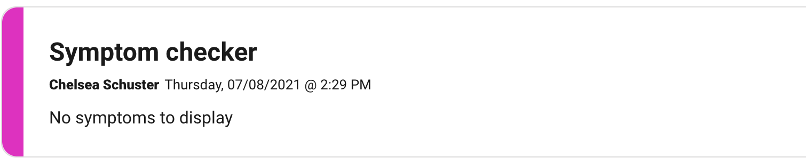
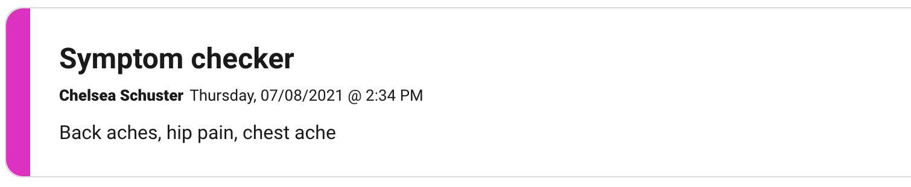

##### SSO Patient Origin Intro

SSO Patient Origin Intro messaging is now available for our customers with an `encounter_origin`.
an `encounter_origin` has 3 fields`title`, `body`, and `label` that are predefined when created.
If you’d like to enable this feature you will need to contact the product team to configure this
option for you. To display a patient Origin Intro in a patients stream you will need to pass in a
few extra parameters when logging in with the [Authentication API](authentication-api.md).

**Note on `encounter_origins`:**

- body maximum length is 200 characters
- title maximum length is 30 characters
- label maximum length is 30 characters

##### Extra Parameters for SSO Patient Origin Intro

| name             | type   | description                                       | required |
| :--------------- | :----- | :------------------------------------------------ | :------- |
| external_plan_id | String | External ID configured on plan                    | true     |
| origin_label     | String | lable of the `encounter_origin`                   | true     |
| welcome_message  | String | text to override the body of a `encounter_origin` | false    |

##### Implementation

After the `encounter_origin` is configured use the `label` value in the `origin_label` parameter
and the `external_id` of the plan you would like to use in the `external_plan_id` parameter.

Example:

```
POST https://staging.cirrusmd.com/sdk/v2/public/sessions
Content-Type: application/json
Accept: application/json
Authorization: Bearer <SIGNED_JWT_ACCESS_TOKEN_FOR_API>

{
    "external_user_id": "<Customer_Specific_Unique_Identifier>",
    "email": "chelsea@schuster.com",
    "first_name": "Chelsea",
    "last_name": "Schuster",
    "dob": "1977-01-11T00:00:00Z",
    "gender": "female",
    "member_id": "<Customer_Specific_Member_Identifier>"
    "external_plan_id": "<Customer_Plan_Specific_External_Identifier>",
    "origin_label": "<Label_Of_Encounter_Origin>",
}
```

This will add a card to the selected plan that will look something like below.



If you would like to add a custom body to the `encounter_origin` you can override the default body value by passing an additional `welcome_message` parameter.

Example:

```
POST https://staging.cirrusmd.com/sdk/v2/public/sessions
Content-Type: application/json
Accept: application/json
Authorization: Bearer <SIGNED_JWT_ACCESS_TOKEN_FOR_API>

{
    "external_user_id": "<Customer_Specific_Unique_Identifier>",
    "email": "chelsea@schuster.com",
    "first_name": "Chelsea",
    "last_name": "Schuster",
    "dob": "1977-01-11T00:00:00Z",
    "gender": "female",
    "member_id": "<Customer_Specific_Member_Identifier>"
    "external_plan_id": "<Customer_Plan_Specific_External_Identifier>",
    "origin_label": "<Label_Of_Encounter_Origin>",
    "welcome_message": "Back aches, hip pain, chest ache"
}
```

Doing this will place the `welcome_message` value in the body as seen below



**Note on `welcome_message` parameter:**

- We currently do not offer any formatting or styling options.
- The maximum length is 200 characters if you go over this limit we will truncate any characters past 200.
